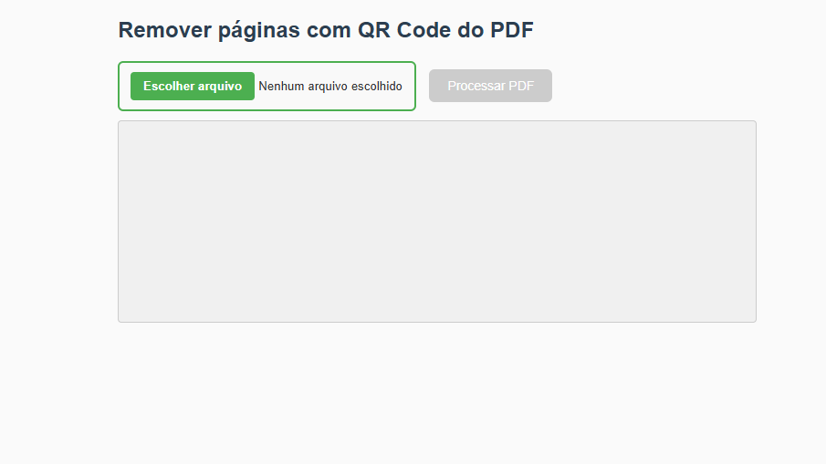

# 🧹 Remover páginas com QR Code de arquivos PDF

Este é um aplicativo web simples e eficiente que **remove automaticamente páginas de um arquivo PDF que contenham QR Codes**. Ele roda **100% localmente no navegador**, sem enviar seus dados para nenhum servidor.

## 🚀 Funcionalidades

- 📄 Processa arquivos PDF direto do seu computador
- 🧠 Detecta QR Codes em cada página usando a biblioteca `jsQR`
- ✂️ Remove apenas as páginas com QR Code
- 💾 Gera um novo PDF para download
- 🔒 Totalmente offline — privacidade garantida

## 🛠 Tecnologias usadas

- [PDF.js](https://mozilla.github.io/pdf.js/) – para renderizar PDFs
- [pdf-lib](https://pdf-lib.js.org/) – para criar/editar arquivos PDF
- [jsQR](https://github.com/cozmo/jsQR) – para detectar QR Codes

## 📸 Captura de tela

 <!-- opcional, se você colocar uma imagem -->

## 📦 Como usar

Este projeto roda totalmente localmente, direto no navegador. Não é necessário instalar nada, nem backend.

---

### 🧪 Modo 1: Executar no navegador (usuários finais)

1. **Baixe ou clone este repositório:**

   - Baixar ZIP:
     - Clique no botão verde `Code` acima e selecione `Download ZIP`.
     - Extraia o conteúdo em uma pasta do seu computador.

   - Clonar via Git (requer Git instalado):
     ```bash
     git clone https://github.com/seu-usuario/remove-qr-pdf.git
     cd remove-qr-pdf
     ```

2. **Abra o arquivo `index.html` no navegador:**

   - Dê um duplo clique no arquivo `index.html`  
   **ou**
   - Arraste o arquivo para uma aba aberta do navegador (Google Chrome recomendado)

3. **Utilize a aplicação:**

   - Clique em **“Escolher arquivo”** e selecione um arquivo PDF do seu computador.
   - Clique em **“Processar PDF”**.
   - O sistema analisará cada página e **removerá aquelas que contêm QR Codes**.
   - Um botão será exibido para **baixar o novo PDF** sem as páginas filtradas.

---

### 🧑‍💻 Modo 2: Desenvolvedores e contribuidores

Se quiser modificar ou contribuir com o código, siga este fluxo:

```bash
# 1. Clone o repositório
git clone https://github.com/seu-usuario/remove-qr-pdf.git
cd remove-qr-pdf

# 2. Abra no editor de sua preferência (VS Code, etc.)
code .

# 3. Faça alterações no arquivo index.html

# 4. Versione e envie suas mudanças
git add .
git commit -m "feat: nova funcionalidade ou melhoria"
git push origin nome-da-sua-branch
